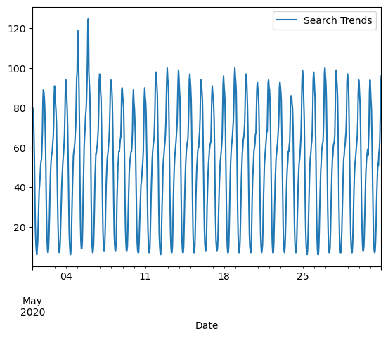
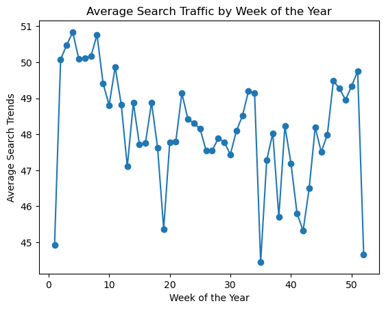
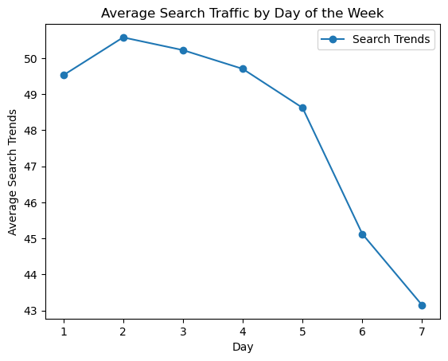
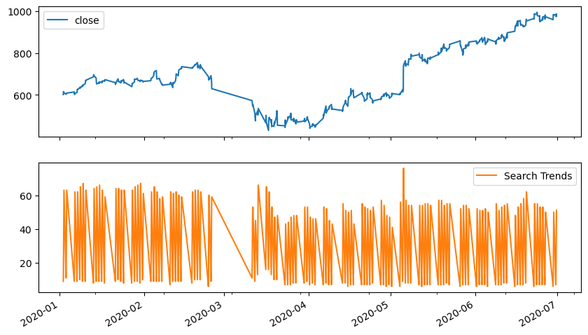
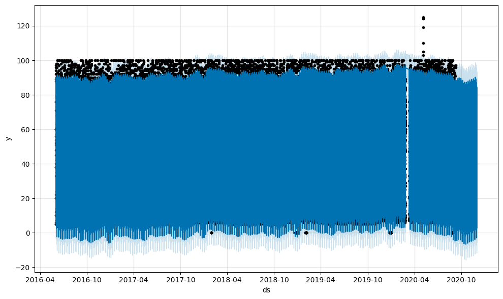
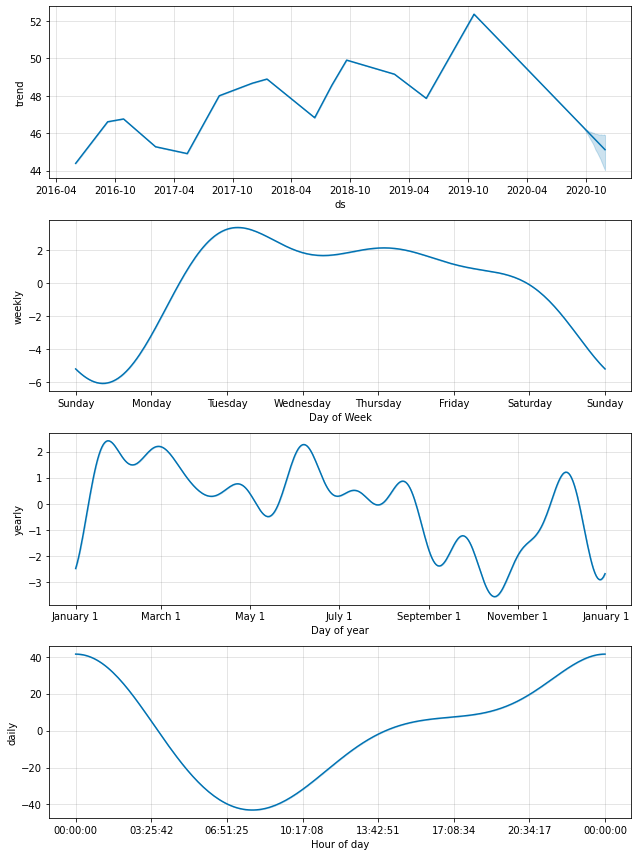

# **MercadoLibre Search Traffic and Stock Price Forecasting Project**

## **Project Overview**

This project aims to analyze Google search traffic and stock prices for MercadoLibre, the leading e-commerce platform in Latin America, to explore the relationship between search traffic and stock price movements. The goal is to determine if search traffic data can be used to predict stock price patterns and develop forecasting models for strategic growth.

The analysis is divided into four main steps:
1. Finding unusual patterns in Google search traffic.
2. Identifying seasonality in the search data.
3. Correlating search trends with stock prices.
4. Forecasting future search trends using Facebook Prophet.

## **Steps and Methodology**

### **Step 1: Find Unusual Patterns in Hourly Google Search Traffic**

In this step, we analyzed the hourly Google search data to identify any unusual spikes or dips. This is important for detecting anomalies that might be linked to external factors, such as news events or quarterly earnings reports.

- **Analysis**: We applied statistical methods to detect outliers in the search traffic.

  
*Figure 1: Anomalies in Google Search Traffic*

---

### **Step 2: Mine the Search Traffic Data for Seasonality**

Next, we decomposed the search traffic time series to identify seasonal patterns. This helps understand the regular cycles (daily, weekly, monthly) in user search behavior.

- **Analysis**: Using time series decomposition, we extracted the trend, seasonality, and residual components to highlight recurring patterns.

#### **Weekly Seasonality**

  
*Figure 2.1: Weekly Seasonality in Google Search Traffic*

#### **Daily Seasonality**

  
*Figure 2.2: Daily Seasonality in Google Search Traffic*

---

### **Step 3: Relate the Search Traffic to Stock Price Patterns**

In this step, we investigate the relationship between Google search traffic and MercadoLibre’s stock prices. We analyzed how changes in search traffic could predict the movement in stock prices.

#### **Do Both Time Series Indicate a Common Trend That’s Consistent with This Narrative?**

**Answer**: Indeed, both the Google search traffic plot and the closing stock price plot indicate a common trend that aligns with the narrative. Both time series show a significant decline starting at the end of February, leading to a drop in stock prices from $752 to its lowest point of $429 in March. However, in April, both search trends and stock prices experienced a notable rebound, suggesting that the anticipated increase in revenue, likely linked to quarterly earnings or market reactions, was reflected in both metrics.

  
*Figure 3: Relationship Between Google Search Traffic and Stock Prices*

---

### **Step 4: Create a Time Series Model with Prophet**

In this step, we applied Facebook's Prophet model to the hourly Google search data to forecast future trends and analyze seasonal patterns.

#### **How's the Near-Term Forecast for the Popularity of MercadoLibre?**

**Answer**: The near-term forecast for the popularity of MercadoLibre shows a general trend of declining search traffic, particularly between **April** and **October**. Based on historical patterns, after this period, there is an expected gradual recovery, with search traffic potentially increasing starting **in October**. It’s essential to monitor ongoing trends closely, as market dynamics can shift rapidly.

  
*Figure 4.1: Time Series Forecast for Google Search Traffic*

#### **What Time of Day Exhibits the Greatest Popularity?**

**Answer**: The time of day with the greatest popularity in terms of search traffic is around **midnight**, when the search volume peaks.

#### **Which Day of the Week Gets the Most Search Traffic?**

**Answer**: **Tuesday** stands out as the day of the week with the most search traffic, according to the Prophet model's seasonal decomposition.

#### **What's the Lowest Point for Search Traffic in the Calendar Year?**

**Answer**: The lowest point for search traffic in the calendar year typically occurs during **mid to late October**, as indicated by the seasonal component of the model.

#### **Plotting the Components of the Forecast**

To better understand the patterns, we plotted the individual time series components extracted by Prophet. These components include:

- **Trend**: Shows the overall trend in search traffic.
- **Weekly Seasonality**: Represents patterns that repeat every week.
- **Yearly Seasonality**: Reflects recurring yearly patterns.

  
*Figure 4.2: Seasonal Components of Google Search Traffic*

These plots provide a clear visualization of the factors influencing search traffic patterns for MercadoLibre.

---

## **Conclusion**

Through this analysis, we found that Google search traffic data contains valuable signals that can potentially be used to predict stock price trends. The search traffic saw an 8.5% increase in May 2020, likely linked to the release of MercadoLibre's quarterly financial results, and the forecasting model built with Prophet provided insights into future search trends.

---

## **How to Use the Code**

- Clone the repository and follow the instructions in the "How to Use the Code" section to replicate the analysis.
- Each figure used in the README is generated during the analysis and stored in the `images/` folder.
